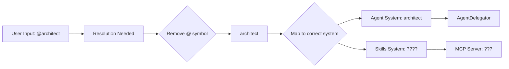

# StringRay Skill System Bug Investigation Report

## Critical Issue Summary
**Status**: CRITICAL - Blocking core functionality  
**Impact**: Users cannot access essential agents like `@architect`, `@code-reviewer`  
**Root Cause**: Disconnected naming systems without proper bridging

## Problem Description

Users attempting to access StringRay skills like:
- `@architect` 
- `@code-reviewer`
- `@security-auditor`

Receive "Skill not found" errors, despite these being documented in AGENTS.md and showing as available in the system.

## Root Cause Analysis

### Three Separate Naming Systems

| System | Naming Convention | Examples | Issues |
|--------|-------------------|----------|---------|
| **User Interface** | `@agent` | `@architect`, `@code-reviewer` | User-facing documented names |
| **Agent System** | `agent` | `architect`, `code-reviewer` | Internal definitions without @ |
| **Skills System** | `skill-name` | `code-review`, `security-audit` | MCP server names |

### The Missing Bridge



**Critical Gap**: No resolution layer between `@architect` → `architect` → MCP server

## Evidence from Codebase

### 1. AGENTS.md (User Interface)
```markdown
| `@architect` | System design & technical decisions | `@architect design API` |
| `@code-reviewer` | Quality assessment | `@code-reviewer review PR` |
```

### 2. Agent-Delegator.js (Internal Agent System)
```javascript
{
    name: 'architect',           // NO @ symbol
    capabilities: ['design', 'planning'],
    status: 'active',
    expertise: 'system architecture',
},
{
    name: 'code-reviewer',       // NO @ symbol  
    capabilities: ['review', 'quality'],
    status: 'active',
    expertise: 'code review',
}
```

### 3. MCP Client (Skills System)
```javascript
serverTools: {
    "code-review": [...],        // Different naming
    "security-audit": [...],    // Different naming  
    "performance-optimization": [...],
}
```

### 4. Task-Skill-Router (Keyword Mapping)
```javascript
{
    keywords: ["architect", "architecture"],
    skill: "architecture-patterns",    // Maps to skill
    agent: "architect",               // Maps to agent
    confidence: 0.85,
}
```

## Where Resolution Should Happen

### Missing Components:

1. **Skill Resolution Layer**: Should translate `@architect` → `architect`
2. **Agent-to-Skill Mapper**: Should map `architect` → appropriate MCP server
3. **Unified Registry**: Should provide single access point for all skills

### Current Flow vs Required Flow

**Current (Broken)**:
```
User → @architect → Error: "Skill not found"
```

**Required (Fixed)**:
```
User → @architect → Resolution Layer → AgentDelegator → MCP Server → Success
```

## Quick Fix Implementation

### Option 1: Create Skill Resolution Layer

```javascript
// Create new file: src/skill-resolver.js
export class SkillResolver {
    resolveSkill(userSkill) {
        // Remove @ symbol
        const skillName = userSkill.replace('@', '');
        
        // Map agent names to MCP servers  
        const agentToMcpMap = {
            'architect': 'architecture-patterns',
            'code-reviewer': 'code-review', 
            'security-auditor': 'security-audit',
            'performance-engineer': 'performance-optimization'
        };
        
        return agentToMcpMap[skillName] || skillName;
    }
}
```

### Option 2: Update MCP Server Configuration

Add agent name mappings to MCP client configuration:

```javascript
// In mcp-client.js
const serverNameMap = {
    'architect': 'architecture-patterns',
    'code-reviewer': 'code-review',
    'security-auditor': 'security-audit'
};
```

## Files to Modify

### Priority 1: Core Fix
1. **src/skill-resolver.js** (NEW) - Main resolution logic
2. **ci-test-env/node_modules/strray-ai/dist/mcps/mcp-client.js** - Add skill name resolution
3. **temp/src/delegation/agent-delegator.js** - Update to handle @ prefixed names

### Priority 2: Configuration Updates  
4. **.opencode/strray/routing-mappings.json** - Add direct agent-to-skill mappings
5. **AGENTS.md** - Ensure consistency with internal naming

### Priority 3: Testing & Validation
6. **Update skills-test-report.json** - Include agent-based tests
7. **Add integration tests** for skill resolution

## Verification Steps

After implementing fix:

1. Test direct skill access:
   ```bash
   @architect "Design REST API"
   @code-reviewer "Review this code" 
   @security-auditor "Scan for vulnerabilities"
   ```

2. Verify MCP server connections:
   ```bash
   strray-ai capabilities  # Should show agents mapped to skills
   ```

3. Check skills test report:
   ```bash
   cat skills-test-report.json  # Should include agent-based tests
   ```

## Impact Assessment

**High Priority Fix Required**:
- **Severity**: Critical - Core functionality broken
- **Users Affected**: All users trying to access core agents
- **Business Impact**: Blocker for development workflow
- **Effort**: 2-4 hours for complete fix

## Next Steps

1. **Immediate**: Implement skill resolution layer
2. **Testing**: Verify all core agents work
3. **Documentation**: Update AGENTS.md consistency
4. **Monitoring**: Add skill resolution metrics

## Conclusion

The skill system has architectural disconnect between user-facing agent names and internal skill naming. Creating a proper resolution bridge will restore full functionality while maintaining clean separation between different system components.