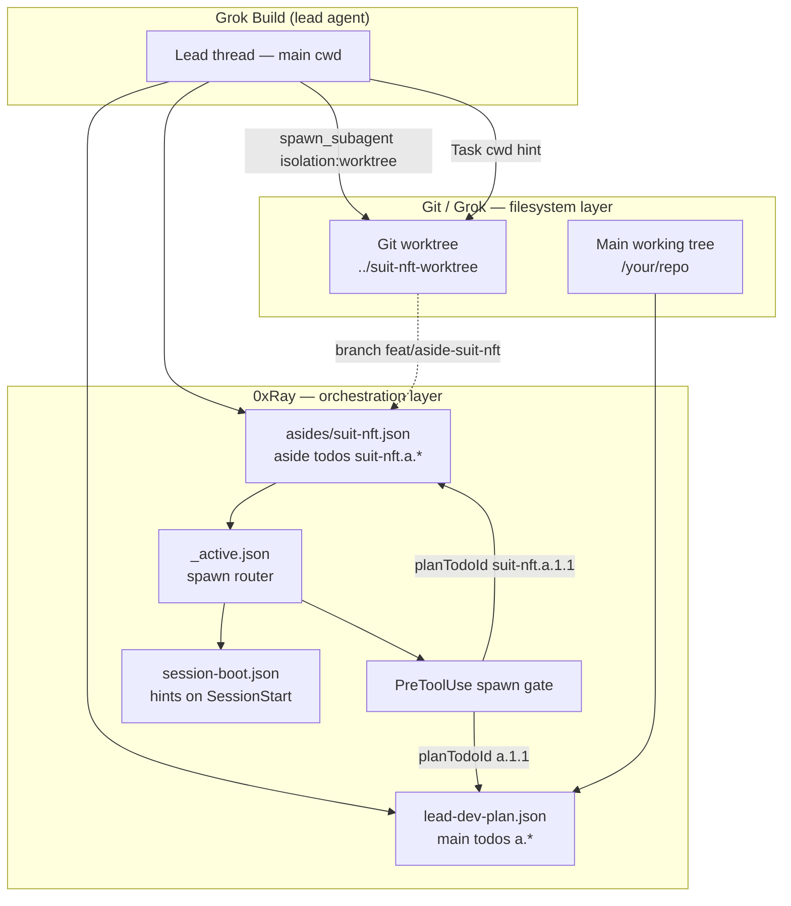
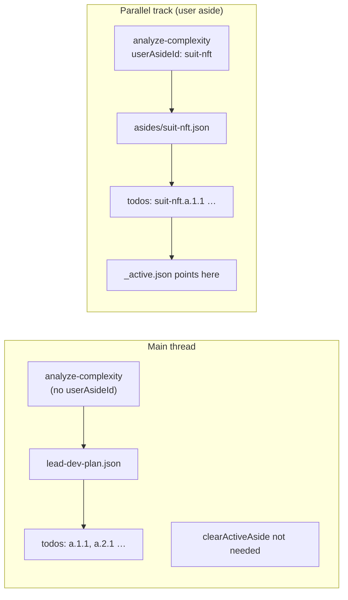

# Parallel Work Tracks — Grok Build + 0xRay User Asides

**Audience:** End users wearing the 0xRay suit in **Grok Build** (Cursor) who want to run main-thread work and a side quest in parallel — without stepping on each other's files or spawn rules.

**Prerequisite:** `npm install 0xray` + `npx 0xray grok install`. User asides ship in **0xRay 4.0.0**.

:::tip Three names, three jobs
Do not confuse these:

| Name | You declare it? | What it controls |
|------|-----------------|------------------|
| **Grok git worktree** | Yes (or the agent does) | **Where on disk** — isolated directory + branch |
| **User aside** (0xRay) | Yes | **Which plan + spawn rules** — parallel todo track |
| **AsideContext** (0xRay) | No — internal | **MCP observation subcontext** — implementation detail |

For a real parallel feature (e.g. `suit-nft`), use **user aside + worktree together**. See [User Asides](./user-asides.md) for MCP fields and [roadmap](./user-asides-roadmap.md) for known gaps.
:::

---

## The problem you are solving

You are in one Grok session on the **main thread** (suit tuning, Repertoire, confer, etc.). You also want a **side quest** — a separate feature branch with its own phased plan and subagent spawns — without:

- edits landing in the wrong directory,
- spawn gate still routing to main-plan todos,
- or losing track of which branch is which.

Three layers address different parts of that problem. They **stack**; none replaces the others.

---

## Architecture — three layers



### Comparison table

| | **Grok worktree** | **User aside** | **AsideContext** |
|---|---|---|---|
| **Governs** | Filesystem isolation | Plan + spawn routing | Internal MCP observations |
| **Persistence** | Real git worktree on disk | `.xray/state/asides/{id}.json` | In-memory during MCP call |
| **You say** | `isolation: worktree` or `git worktree add` | `userAsideId` on `analyze-complexity` | *(nothing — automatic)* |
| **Enforcement** | Grok `x.ai/git/worktree/*` | PreToolUse spawn gate | Orchestrator lifecycle only |
| **Creates branch/dir** | Yes (when configured) | No — metadata hints only | No |

---

## State on disk — three channels

0xRay state in Grok Build flows through **three channels**. Do not confuse them.

| Channel | What | Always current? |
|---------|------|-----------------|
| **Persistence** | MCP + hooks write `.xray/state/*.json` | After intake / activate |
| **Enforcement** | PreToolUse reads plan + `_active.json` from disk on **every** tool call | **Yes** — spawn gate never uses stale in-memory cache |
| **Awareness** | `session-boot.json` hints on disk | Refreshed each UserPromptSubmit; lead must **Read** the file (Grok ignores hook stdout) |

Every session, Grok hooks write **`.xray/state/session-boot.json`** on SessionStart and UserPromptSubmit. That file is the suit's **hint channel** for the lead agent — not the enforcement SSOT.

```
.xray/state/
├── session-boot.json          # refreshed each hook — lead_dev_mode, activeAside hints
├── lead-dev-plan.json         # main thread phased plan (after analyze-complexity)
├── pending-delegations.json   # in-flight spawn queue
└── asides/
    ├── suit-nft.json          # aside definition + namespaced plan
    └── _active.json           # which aside receives spawns
```

### What session-boot loads today

| Field | Source | Meaning for you |
|-------|--------|-----------------|
| `lead_dev_mode` | `features.json` | Suit rules active |
| `activeAside` | `_active.json` + aside file | Spawns route to `{id}.a.*` todos |
| `asideWorktree` | aside metadata | **Hint** — lead must point spawns here |
| `asideBranch` | aside metadata | **Hint** — expected git branch |
| `asideTrapSignals` | aside governance | Repertoire signals to watch |
| `asideConferRecommended` | aside governance | Manual confer suggested |
| `conferPending` | synthesis state | Main-thread confer may be due |

### What session-boot does **not** summarize yet

Boot carries **hints** (`activeAside`, `asideWorktree`, confer flags). It does not yet embed `leadDevPlanSummary` or `activeAsidePlanSummary` (next todo, phase progress). For full todo lists on intake, `analyze-complexity` and `orchestrate-task` already return formatted plan text in the MCP response.

On resume without MCP, the lead should Read `session-boot.json` plus the active plan file, or call `get-orchestration-status`. See [Roadmap](./user-asides-roadmap.md) P1 awareness items.

:::info Enforcement is always live
Spawn routing reads `_active.json` and plan files directly — not `session-boot.json`. Activating an aside updates routing immediately even if boot hints lag until the next user message.
:::

:::note Grok hook contract
Grok **ignores** SessionStart and UserPromptSubmit hook stdout. Hooks persist state to disk; the lead agent does not auto-receive boot JSON in context.
:::

---

## Correct setup checklist

You are using Grok Build correctly when all of these are true:

- [ ] **Suit worn** — `features.json` → `multi_agent_orchestration.lead_dev_mode: true`
- [ ] **Grok bridge** — `npx 0xray grok install` (7 MCPs + PreToolUse hook)
- [ ] **Intake before spawn** — `analyze-complexity` ran before any `Task` / `spawn_subagent`
- [ ] **State exists** — `.xray/state/lead-dev-plan.json` (main) or `asides/{id}.json` (aside)
- [ ] **Parallel track** — aside intake **and** explicit worktree/cwd on spawns (both required)
- [ ] **Resume main** — `orchestrate-task` with `clearActiveAside: true` when side quest pauses

Optional but recommended for this stack:

- [ ] **Repertoire** — `memory_routing.enabled` + Repertoire MCP for signal-aware routing

---

## Main thread vs parallel track



**Main thread** — default. One plan, global `a.*` todo ids, main cwd.

**Parallel track** — you declare an aside. Namespaced todos, spawn gate follows aside plan while active, optional worktree/branch metadata.

Only **one active aside per workspace** at a time. Switch tracks with `clearActiveAside` before activating another.

---

## End-to-end: parallel feature (suit-nft example)

### Step 1 — Create git isolation (filesystem)

Either you or the lead agent:

```bash
git worktree add ../suit-nft-worktree feat/aside-suit-nft
```

Or tell Grok to spawn with `isolation: worktree` (Grok manages worktrees via `x.ai/git/worktree/*`).

This step is **Grok/git**. User aside does not run `git worktree add` for you.

### Step 2 — Intake the aside (orchestration)

`xray-orchestrator` → **`analyze-complexity`**:

```json
{
  "userAsideId": "suit-nft",
  "userAsideTitle": "Suit-certified NFT mint",
  "worktree": "../suit-nft-worktree",
  "branch": "feat/aside-suit-nft",
  "sessionId": "<your-grok-session-id>",
  "tasks": [
    { "description": "Groover registration proof", "type": "research" },
    { "description": "Mint flow implementation", "type": "implementation" }
  ]
}
```

This writes `asides/suit-nft.json`, activates `_active.json`, and namespaces todos as `suit-nft.a.1.1`, etc.

### Step 3 — Spawn subagents (both layers)

When delegating, the lead must satisfy **both**:

1. **Spawn gate** — `planTodoId: "suit-nft.a.1.1"` (aside routing)
2. **Filesystem** — prompt includes *"Run all commands and edits in `../suit-nft-worktree`"* or `cwd` / `isolation: worktree`

Example Task prompt pattern:

```
Implement mint flow in ../suit-nft-worktree (branch feat/aside-suit-nft).
Todo: suit-nft.a.2.1. Run per-suite tests in that worktree; report paths touched.
```

### Step 4 — Resume main thread

`xray-orchestrator` → **`orchestrate-task`**:

```json
{ "description": "resume main suit work", "clearActiveAside": true }
```

Spawns return to main `lead-dev-plan.json` todos (`a.*`).

### Step 5 — Reactivate aside later

```json
{ "description": "continue suit-nft", "userAsideId": "suit-nft" }
```

Existing aside plan reloads; `_active.json` updates.

---

## Grok-native worktrees (without user aside)

When you only say *"spin up worktrees and manage them"*, you get **filesystem isolation only**:

| Grok capability | What it does |
|-----------------|--------------|
| `spawn_subagent` + `isolation: worktree` | Child gets isolated git worktree |
| `spawn_subagent` + `cwd` | Child runs in specified directory |
| `/fork --worktree` | New session fork in a worktree |
| `grok -w` / `grok --worktree=feat` | New session starts in worktree |
| `x.ai/git/worktree/apply` | Merge worktree changes back to main |

**Gap without user aside:** PreToolUse spawn gate still follows **main** `lead-dev-plan.json`. Parallel files, main orchestration rules.

Use this for quick isolated experiments. Use **user aside + worktree** for governed parallel features.

---

## User aside vs "manage worktrees" — decision tree

| Separate plan? | Separate files? | Use |
|----------------|-----------------|-----|
| No | No | Main thread only (`lead-dev-plan.json`) |
| No | Yes | Grok worktree only (`isolation: worktree`) |
| Yes | No | User aside only — **risky** (shared cwd) |
| Yes | Yes | **User aside + worktree** (recommended) |

| Mistake | What happens |
|---------|--------------|
| Worktree only, no aside intake | Files isolated; spawn gate on main plan |
| Aside only, no cwd in spawns | Gate happy; edits may hit main cwd |
| Confuse AsideContext with user aside | Internal MCP routing, not your side quest |
| Multiple active asides | Not supported — one `_active.json` |
| Omit `sessionId` on intake | Any session may route to aside until cleared |

---

## AsideContext — ignore unless you hack orchestrator

[AsideContext](./aside-context.md) is an **internal** bounded subcontext created during `orchestrate-task`, `analyze-complexity`, and `govern-and-apply`. It accumulates governance/orchestration observations and can inherit Repertoire `memoryRouting`.

**You never declare AsideContext.** It is not a user-facing parallel work track.

If docs or agents mention "aside" without "user aside", check context — they may mean AsideContext.

---

## Natural language — what to tell your lead agent

| Goal | Say this |
|------|----------|
| Start parallel feature | *"Intake user aside `suit-nft` with worktree `../suit-nft-worktree` on branch `feat/aside-suit-nft` — tasks: …"* |
| Work the aside | *"Work my `suit-nft` aside — next todo, spawns in the worktree"* |
| Back to main | *"Clear active aside and resume main plan"* |
| Worktree only (quick) | *"Spawn implementer in worktree isolation for …"* |
| Check state | *"Read `.xray/state/session-boot.json` and aside plan — what's active?"* |

---

## Config reference

`features.json`:

```json
{
  "multi_agent_orchestration": {
    "lead_dev_mode": true,
    "user_asides": {
      "enabled": true
    }
  }
}
```

`user_asides.enabled` defaults to **true** when `lead_dev_mode` is on. Set `false` to disable aside intake and routing.

---

## Related

- [User Asides](./user-asides.md) — MCP fields, state layout, accepted limitations
- [User Asides Roadmap](./user-asides-roadmap.md) — engineering backlog (state loading, cwd enforcement, …)
- [AsideContext](./aside-context.md) — internal orchestrator subcontext (different concept)
- [Platform Integrations](./integrations.md) — Grok bridge install
- [Autonomy Command](./autonomy-command.md) — lead-dev default operating model
- [Repertoire](./repertoire.md) — memory routing into orchestrator