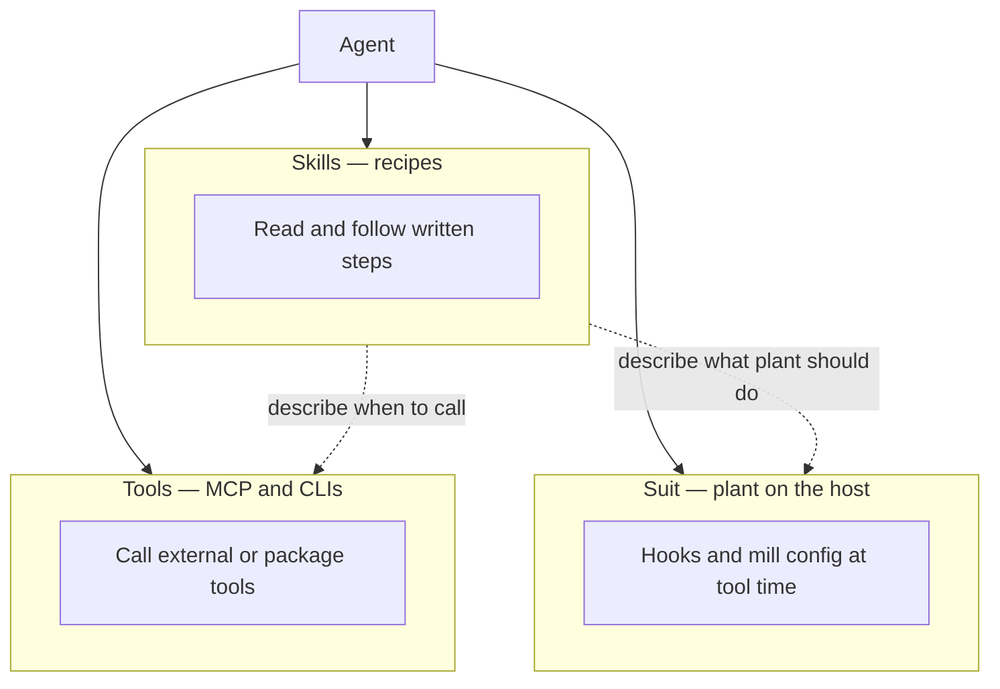

# Three layers — suit, skills, tools

0xRay is splitting into a higher-level model: a **factory** that plants a thin suit, not a pile of overlapping systems. These three layers do different jobs. Mixing their names is what creates fog.

## Plain meanings

| Layer | One line | Lives where | Example |
|-------|----------|-------------|---------|
| **Skills** | Instructions the agent reads and follows | Skill files / `AGENTS.md` / live docs | ship-ready steps, factory register→mint→pin |
| **Suit** | Automatic checks and plant config on the host | `.xray/`, host hooks, mill inventory | before-write gate, light after-write, `foundry inspect` |
| **Tools** | Things you invoke (MCP servers, CLIs) | MCP list, `npx @0xray/foundry …` | registry MCP, `foundry gate`, Dynamo |

They are **not** three names for the same thing.

- A skill can describe a loop that no MCP exposes.
- A suit hook can run even when no skill was opened.
- An MCP can exist that skills never mention (legacy processor-pipeline is an example — do not treat it as the factory OS).

## Release spine (thin)

Use this order when shipping. Do not rebuild the old processor manager as bot gates.

1. Before write/spawn — host pre-tool gate (when the suit is worn)
2. After write — light postprocessor (on in current plants)
3. Before/after commit and before push — git hooks on the **product repo**
4. Before tag/publish — `npx @0xray/foundry gate` then `gate --verify-only`
5. Wear check — `npx @0xray/foundry inspect`
6. Docs — `npx @0xray/foundry docs-check` (+ live URL checks when agents must read the site)

## Grok Bot note

This host is not a fake “deny every bad tool” floor. Skills + reviewer proof carry the rules; suit hooks help when worn. Map **roles** from the coding-agent MCP set into existing tools — don’t clone seven servers for theater.

## Related
- Processor catalog map: `PROCESSORS-MAP-GROK.md`
- Wear proof: `SUIT-ATTESTATION.md`
- This pass checklist: `HOOKS-GATE-CHECKLIST.md`
